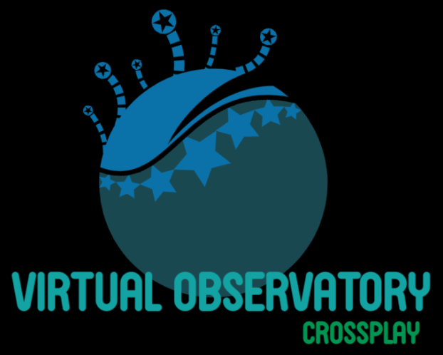

# VirtualObservatory by Crossplay
## Team details
### Team name: 
- Crossplay

### Team members: 
- Plamen Nikolov (Username in telerikacademy.com - plamen.r.nikolov)
- Rosen Ivanov (Username in telerikacademy.com - rosen.ivanov)

## Gitlab repository 
- Link: https://gitlab.com/Rosen-Ivanov/virtualobservatory

## Used assets in the project
- TypeScript
- NestJS
- MariaDB
- TypeORM
- TSLint
- GitLab

### Project Description:
    Open-source application written in Typescript.
    The project Virtual Observatory is a database storage 
    for astronomical observations and data acquiring/retrieving. 
    Actually it was realised as reference database for 
    describe/identification of astronomical objects and it can provide basic data information, 
    cross-identifications, and astronomical observations of the objects.
    In the project were used Nestjs and TypeORM for a back-end logic, 
    and MariaDB/MySQL database servers for a relational database design.
    
### Project Information:
    This project is composed of:
    * public part - accessible without authentication
        - Home page message, No data available; 
    * private part - available for registered users
        - The user have to be registered and logged in.
        - The users can add, update and extract data. 
        - Limitations about specific data access and operations.  
    * administrative part - available for administrators only
        - First registered user is admin by default.
        - Admin can create users and to change their role.
        - Admin has a full control over the data access and manipulation.
    
### License
This project is licensed under the MIT License